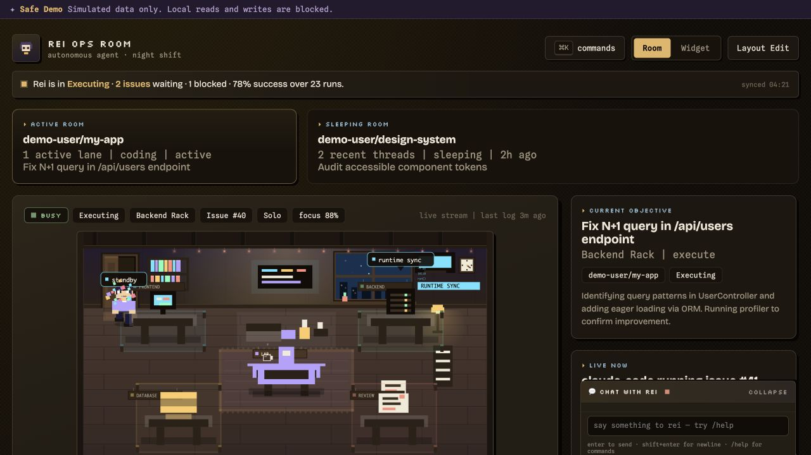

# Rei Ops Room

[](https://github.com/Wallens11/rei-ops-room/actions/workflows/test.yml)


[](LICENSE)

A local-first control room for GitHub-driven coding agents. Turn approved issues
into observable Claude Code or Codex runs, with queue state, runtime activity,
human intervention points, and results visible in one real-time pixel-art room.

No framework, build step, hosted control plane, or runtime npm dependencies.



### Try the Safe Demo

```bash
git clone https://github.com/Wallens11/rei-ops-room
cd rei-ops-room
npm run demo
```

Open `http://localhost:4317`. The demo needs no GitHub token, AI runtime, or
`npm install`; it serves simulated state and blocks local reads and writes.

---

## Why It Stands Out

- **Safe Demo contract** — public visitors get realistic simulated state while local memory, chat, codebase, run logs, and write actions stay blocked
- **Human approval before execution** — `mode:execute` issues wait for `status:approved`; labeling an issue is not enough to run code
- **Runtime truth, not a fake swarm** — the room visualizes real queue, worker, GitHub, and runtime state
- **Last-mile self-review** — protected files, malformed output, debug leftovers, and suspicious diffs are checked before a run is marked complete
- **Local-first and dependency-light** — no hosted control plane, frontend framework, database service, or runtime npm dependency

The result is an operator-facing control room with personality, not a generic agent dashboard.

---

## What Rei Does

- **Picks up approved GitHub issues** labeled `agent:rei` + `mode:execute` + `status:approved`
- **Routes to the right runtime** — Claude Code for frontend/docs, Codex for backend/scraping — configurable per task type
- **Falls back automatically** when a runtime hits rate limits
- **Resumes sessions** after crashes using Claude Code's `--resume` flag
- **Learns from history** — adaptive runtime selection based on actual success rates
- **Reacts to human corrections** — comments on an issue mid-run get injected into the next prompt
- **Generates visual artifacts** — HTML diagrams via the visual-explainer skill, surfaced in the UI
- **Wakes up instantly** on GitHub webhook events instead of waiting for the poll interval

---

## Quick Start

```bash
# 1. Clone and run the setup wizard
git clone https://github.com/Wallens11/rei-ops-room
cd rei-ops-room
./rei init       # interactive setup: config, GitHub labels, test connection

# 2. Start the ops room server
npm start
# → http://localhost:4317

# 3. Start the execute worker (in another terminal)
npm run execute-service -- start
```

### Launcher shortcuts

```bash
./rei room     # open ops room in browser
./rei status   # check if the server is running
./rei stop     # stop the server
./rei init     # run setup wizard again
```

### Docker

```bash
# Demo mode — no setup needed
docker run --rm \
  -p 127.0.0.1:4317:4317 \
  -e DEMO_MODE=true \
  ghcr.io/wallens11/rei-ops-room:main
```

The image runs as the non-root `node` user (UID 1000) and the `main` tag is
published for both `linux/amd64` and `linux/arm64`. If you bind-mount a writable
workspace for live execution, make sure UID 1000 can write to that directory.

The published image is best suited to the safe demo and control-plane UI. Live
execution also needs the selected AI runtime CLI and a mounted workspace.

---

## Requirements

- Node.js 22+
- GitHub access — either:
  - `GITHUB_TOKEN` env var (recommended, works in Docker / CI)
  - or `gh` CLI authenticated (`gh auth login`)
- At least one AI runtime:
  - [Claude Code](https://github.com/anthropics/claude-code) (`claude` in PATH)
  - [Codex](https://github.com/openai/codex) (`codex` in PATH or via `CODEX_BIN`)

---

## Configuration

Copy the example config and edit:

```bash
cp rei.config.json.example rei.config.json
```

`rei.config.json` (gitignored — see `rei.config.json.example` for all options):

```json
{
  "repo": "your-org/your-repo",
  "workspacePath": "/path/to/your/workspace",
  "host": "127.0.0.1",
  "port": 4317,
  "githubWebhookSecret": "",
  "statusStreamIntervalMs": 2000,
  "webhooks": {
    "slack": "",
    "discord": "",
    "events": "completed,failed,blocked"
  }
}
```

Environment variables take priority over the config file. Core mappings:
`GITHUB_REPO`, `WORKSPACE_ROOT`, `REI_HOST`, `PORT`, `CODEX_HOME`,
`CODEX_BIN`, `CLAUDE_BIN`, `DAILY_DEVICE_HANDOFF_PATH`,
`GITHUB_WEBHOOK_SECRET`, and `STATUS_STREAM_INTERVAL_MS`.

### Runtime Routing

Create `.rei-runtimes.json` in the repo root to configure which runtime handles which task type:

```json
{
  "preferences": {
    "frontend": ["claude-code", "codex"],
    "backend":  ["codex", "claude-code"],
    "scraping": ["codex"],
    "docs":     ["claude-code", "codex"],
    "general":  ["codex", "claude-code"]
  },
  "rateLimitFallback": true
}
```

If the file is absent, the defaults above are used.

---

## GitHub Webhook (optional)

Point your GitHub repo's webhook to `http://your-server:4317/api/github/webhook`.

Set `githubWebhookSecret` in `rei.config.json` (or `GITHUB_WEBHOOK_SECRET` env var) to the same secret you set in GitHub. Leave it empty to skip signature verification in dev.

Rei wakes up the worker immediately on:
- Issue labeled with `agent:rei` or `mode:*`
- Issue assigned / unlabeled
- Issue comment created
- Any push
- Pull request merged

---

## Security Boundaries

- The server binds to `127.0.0.1` by default. The API does not provide user
  authentication, so do not bind it to a wider network unless a trusted reverse
  proxy supplies authentication and access control.
- Safe Demo serves isolated fixtures and blocks local-data reads, run-log access,
  task submission, handoff generation, chat writes, memory writes, and inquiry
  intake.
- Configure `GITHUB_WEBHOOK_SECRET` before accepting GitHub webhooks outside
  local development. An empty secret intentionally skips signature verification.
- Local config, state, memory, chat, costs, run output, and `.env*` files are
  gitignored. Do not commit tokens or personal workspace paths.

See [SECURITY.md](SECURITY.md) for private vulnerability reporting and
[PUBLIC_READINESS.md](PUBLIC_READINESS.md) for the current audit evidence and
remaining release risks.

---

## Outbound Webhooks (Slack / Discord / generic)

Get pinged when Rei finishes (or fails) a run. Set any of these env vars:

```bash
export REI_SLACK_WEBHOOK_URL=https://hooks.slack.com/services/…
export REI_DISCORD_WEBHOOK_URL=https://discord.com/api/webhooks/…
export REI_WEBHOOK_URL=https://example.com/your-relay     # raw JSON POST
export REI_WEBHOOK_EVENTS=completed,failed,blocked        # default
```

Or put them under `webhooks:` in `rei.config.json`:

```json
{
  "webhooks": {
    "slack": "https://hooks.slack.com/services/…",
    "discord": "https://discord.com/api/webhooks/…",
    "events": "completed,failed,review_needed"
  }
}
```

Supported event kinds: `started`, `completed`, `failed`, `blocked`,
`review_needed`, `aborted`. Failures are swallowed — Rei never crashes
because Slack is down.

---

## GitHub Labels

Rei uses these labels to manage issue state:

| Label | Meaning |
|---|---|
| `agent:rei` | Issue belongs to Rei |
| `mode:execute` | Run code autonomously |
| `mode:report_only` | Post a plan comment only |
| `status:todo` | Queued, waiting to run |
| `status:in_progress` | Currently running |
| `status:blocked` | Run completed but needs human review |
| `status:done` | Completed successfully |

Run the setup wizard to create these labels automatically:

```bash
node setup.mjs
```

---

## Execute Service

```bash
npm run execute-service -- start    # start background worker
npm run execute-service -- status   # check worker status
npm run execute-service -- stop     # stop worker
```

The worker:
- polls GitHub every 60s (or wakes immediately on webhook events)
- claims the next `status:todo` issue, transitions it to `status:in_progress`
- launches Claude Code or Codex with the issue body + daily handoff as context
- posts a completion comment and transitions the label when done
- falls back to the next runtime if rate-limited
- resumes the last Claude Code session on the same issue after a crash

State files (all gitignored):
- `.execute-worker-state.json` — current worker state
- `.execute-queue.json` — task queue
- `.execute-learning.json` — run history for adaptive selection
- `.execute-sessions.json` — Claude Code session pins for crash recovery
- `.execute-runs/` — per-run artifacts (prompt, events, last message)

---

## Report-Only Service

For issues that should get a plan comment but not run code:

```bash
npm run report-only-service -- start
npm run report-only-service -- status
npm run report-only-service -- stop
```

---

## Visual Artifacts

When Claude Code uses the bundled `visual-explainer` skill, it generates self-contained HTML files in `~/.agent/diagrams/`. Rei scans for these after each run and surfaces them in the **Visual Outputs** panel in the UI.

Access directly:
```
GET /api/execute/artifacts
GET /api/execute/artifacts/:filename.html
```

---

## API Reference

| Endpoint | Description |
|---|---|
| `GET /api/health` | Server health and version |
| `GET /api/status` | Current room and runtime state |
| `GET /api/github/issues` | GitHub inbox |
| `GET /api/github/execute` | Execute queue preview |
| `GET /api/github/execute/service` | Worker status |
| `POST /api/github/execute/service` | Start / stop worker |
| `GET /api/execute/queue` | Direct task queue |
| `POST /api/execute/submit` | Submit a direct task |
| `GET /api/execute/metrics` | Agent performance metrics |
| `GET /api/execute/artifacts` | List HTML artifacts |
| `GET /api/execute/artifacts/:file` | Serve artifact HTML |
| `POST /api/github/webhook` | GitHub webhook receiver |
| `POST /api/inquiry/intake` | External inquiry intake |

---

## Architecture

```
rei-ops-room/
├── server.mjs              # HTTP server (all routes)
├── setup.mjs               # Interactive setup wizard
├── rei                     # Bash launcher (start/stop/status)
├── public/                 # Frontend (vanilla JS, no bundler)
│   ├── app.js
│   ├── execute-agent-view.js
│   ├── execute-metrics-panel.js
│   ├── execute-artifacts-panel.js
│   └── ...
├── tools/
│   ├── execute-worker.mjs      # Core execution loop
│   ├── execute-bridge.mjs      # GitHub → prompt builder
│   ├── execute-queue.mjs       # Multi-worker queue
│   ├── execute-learning.mjs    # Adaptive learning + metrics
│   ├── execute-sessions.mjs    # Claude session pinning
│   ├── execute-artifacts.mjs   # HTML artifact scanner
│   ├── inject-skills.mjs       # Skill installer for Claude Code
│   ├── rei-cli.mjs             # Server start/stop/status CLI
│   ├── rei-config.mjs          # Centralized config loader
│   ├── runtimes/               # Runtime adapters (claude-code, codex)
│   └── skills/                 # Bundled Claude Code skills
│       └── visual-explainer/
└── tests/                  # 500+ tests on Node's built-in runner
```

---

## Development

```bash
# Run tests
npm test

# Run tests in watch mode (Node 22+)
node --test --watch tests/*.test.mjs
```

No build step. No transpilation. Edit and reload.

---

## AI Assistance Disclosure

AI tools assisted with ideation and implementation. Product requirements,
security decisions, code review, verification, and release decisions remain
maintainer-owned. Contributions are judged by their tests and behavior, not by
who or what drafted them.
